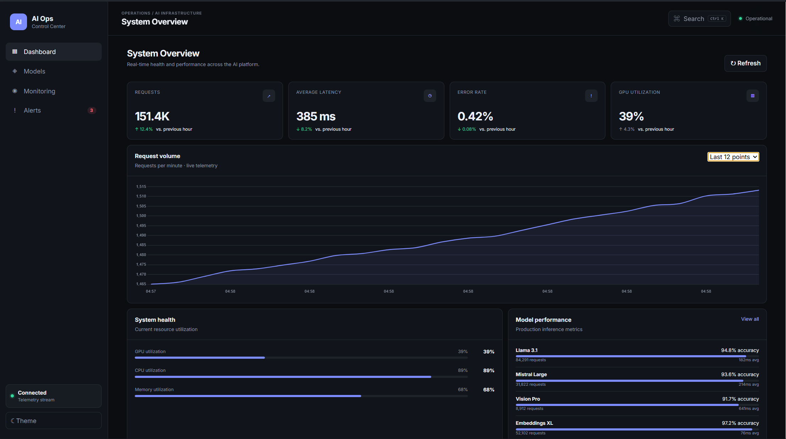

# AI Operations Control Center

A real-time AI infrastructure monitoring dashboard built with **jQuery, JavaScript, Node.js, Express, WebSockets and Chart.js**.

### Dashboard


## Features

- Real-time system telemetry over WebSockets
- REST API built with Express
- Dashboard metrics for requests, latency, errors and GPU usage
- Interactive request-volume chart
- AI model inventory with search, status filtering and pagination
- Model detail modal
- Alert management and bulk resolution
- Live activity stream
- Dark/light theme persisted with localStorage
- Command palette with `Ctrl + K`
- Responsive enterprise-style UI
- Loading, empty and error states
- Model registration through the REST API
- Modular JavaScript architecture

## Architecture

```text
Browser
  │
  ├── jQuery UI
  │     ├── Dashboard
  │     ├── Models
  │     ├── Alerts
  │     └── Monitoring
  │
  ├── REST API ───────────────┐
  │                           │
  └── WebSocket ──────────────┤
                              ▼
                        Node.js / Express
                              │
                         In-memory data
                              │
                         WebSocket server
```

## Tech stack

### Frontend

- HTML5
- CSS3
- JavaScript ES6+
- jQuery 3.7
- Chart.js

### Backend

- Node.js
- Express
- WebSocket (`ws`)
- REST API

### Persistence

The MVP uses in-memory mock data plus browser `localStorage` for UI preferences. This keeps the project easy to run and demonstrates the frontend/backend architecture without requiring a database.

## Getting started

Requirements:

- Node.js 18+
- npm

Install dependencies:

```bash
npm install
```

Start the server:

```bash
npm start
```

Open:

```text
http://localhost:3000
```

For development with Node's watch mode:

```bash
npm run dev
```

## API

```text
GET    /health
GET    /api/metrics
GET    /api/models
GET    /api/models/:id
POST   /api/models
GET    /api/alerts
PATCH  /api/alerts/:id/resolve
GET    /api/activity
```

Example:

```bash
curl http://localhost:3000/api/metrics
```

## WebSocket

The server broadcasts simulated telemetry every ~2.2 seconds.

Example payload:

```json
{
  "type": "telemetry",
  "metrics": {
    "gpuUtilization": 78,
    "cpuUtilization": 61,
    "memoryUtilization": 68
  },
  "activity": {
    "type": "INFERENCE",
    "message": "Llama 3.1 inference completed"
  }
}
```

The browser consumes the stream and updates the dashboard without reloading the page.

## Project structure

```text
jquery-ai-ops/
├── index.html
├── package.json
├── README.md
├── .gitignore
├── server/
│   ├── api.js
│   ├── data.js
│   └── server.js
└── src/
    ├── css/
    │   ├── base.css
    │   ├── components.css
    │   └── dashboard.css
    └── js/
        ├── alerts.js
        ├── api.js
        ├── app.js
        ├── charts.js
        ├── dashboard.js
        ├── models.js
        ├── state.js
        ├── utils.js
        └── websocket.js
```

## License

MIT
